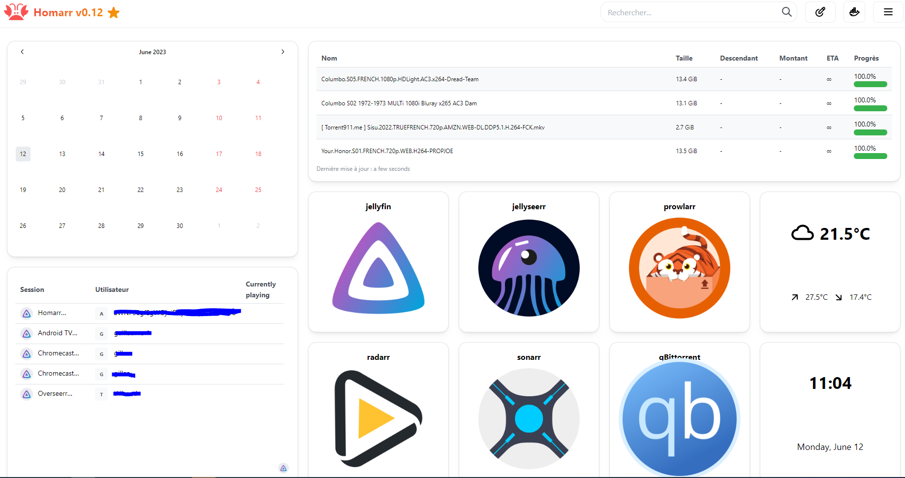

# The Ultimate Jellyfin Media Stack
Voici la stack ultime de Media Server permettant de déployer de manière automatisé et simple une stack de serveur de média pour vos films et séries préférées.

*Homarr Dashboard*

Cette stack complète est composé des éléments suivants :
- Automatisation de l'ensemble des outils via Argocd (En utilisant la chart helm de bitnami)
  - Automatisation des repositories ArgoCD
  - Automatisation des applications ArgoCD
- Déploiement d'un cert-manager pour la gestion automatisées des certificats
- Déploiement d'un DynDNS pour la gestion automatisées de vos records DNS
- Déploiement d'un gestionnaire de Torrent qBittorrent
  - Ajout d'un sidecar gluetun connecté à IVPN en wireguard pour sécurisé le téléchargement de vos torrent
- Déploiement des différents indexers jackett, prowlarr et nzbhydra2
- Déploiement des projets **\*ARR** (Sonarr, Radarr and you can add any one you wan't) (Will add Lidarr and Readarr in futures releases)
- Déploiement de Bazarr pour la gestion des sous-titres (vraiment pratique pour les animes et les séries très récentes)
- Déploiement de downloader usenet avec sabnzbd
- Déploiement de Jellyseerr qui permettra de gérer de manière automatisé vos demandes de nouveau films / series (Un petit CSS custom est en cours pour avoir le lien directement depuis Jellyfin)
- Déploiement de flaresolver pour tout vos soucis de captcha
- Déploiement de Jellyfin bien entendu pour l'accès à vos média favoris :D
- Déploiement d'Homarr pour un dashboard cool et fluide (voir image ci-dessus)
- Déploiement d'un proxy Nginx pour sécurisé nos endpoints une configuration permettant l'accés local only sur certains ingress et un accés internet pour ceux de votre choix

Toutes ses applications sont déployer directement sur Kubernetes, tout les workflow ont été automatisé et sont facile à maintenir à jours. J'ai fait le choix d'utiliser scaleway comme provider DNS mais vous pouvez utiliser celui de votre choix tant que vous êtes capable de faire la modification par vous même. Si tel est le cas, il faudra modifier la configuration de cert-manager et de dyndns (vous pouvez faire un cronjob assez facilement pour du dyndns en homelab)

Mon homelab tourne à l'intérieur d'un cluster Kubernetes utilisant Docker Windows 10 et WSL2. Mais vous pouvez bien entendu utilisé n'importe quel cluster Kubernetes en ajoutant quelques adaptation (par exemple sur les CSI)
J'ai autorisé l'accés Internet de mon ingress uniquement pour Jellyfin et Jellyseerr et je déconseille d'exposer l'intégralité de la stack !
J'ai autorisé mon pod Jellyfin à utilisé ma Carte Graphique pour du transcoding en utilisant le Container Runtime de Nvidia, ca permet d'ajouter un gros gain en performance !